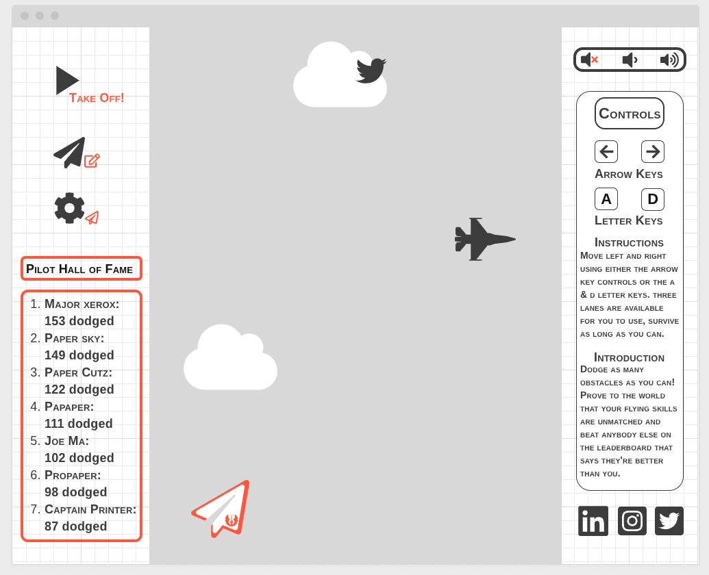

# Paper Plane Game
[Play paper plane](https://jangcla.github.io/paper-plane-game/)

## The first attempt at creating my first video game.

## Background:

My game is a simple obstacle dodging game. In the game you control a paper air plane the flies through a terrain with different obstacles that try to block your path. With three different lanes to chose from( left, middle, and right). The goal of the game is to dodge as many obstacles for as long as possible. My hope in the game is that as you pass more blocks the background will change indicating your current progress as well as a steady increase in the difficulty of the game. 

The game mechanics are very simple, the user is given 2 key controls to navigate through the game, either the "A" and "D" || "<-" and "->" keys. The objective of the game is to last as long as you can, and the background visuals will change the longer the player stays alive. The user's score is then recorded and posted onto a leader board that displays previous user best scores to then brag and compete with another.

## Functionality & MVPs
### In paper planes game, users will be able to: 
*  ~ Will create a loop that renders a continuos background moving down.

*  ~ Create a method that generates random obstacles that block the user. 

*  ~ Create another method that progressively create more obstacles to dodge the longer the player plays the game.

*  ~ Develope a method that moves the player left and right allowing to change to the three different lanes.
  
*  ~ A button to change the players paper plane at random. 

### In addition, this project will include:
*  ~ A music volume controller (sound up, sound down, and mute sound)
  
* ~ A database that saves user scores and present it onto the site.
  
*  ~ Have a brief instruction on how to play the game
  
*  ~ Include different social platforms that link to me.
  

## Wireframes

### Please refer to image above for the initial blueprint of what the website and game will look like for this project.

* ~ Game controlls include a play, settings, customize, and music buttons.

* ~ Has image links for my social media accounts to give attention to future scouts

* ~ Has the game centered in the middle of a section containing starting options and a section that introduces and gives an instruction guide on how to play the game.

## Technologies, Libraries, APIs
### This project will implement the following technologies:

* ~ The use of Vanilla DOM for animation and controlling movement
* ~ Webpack and Bael to bundle and transpile the JavaScript code
* ~ npm for the management of project dependencies

## Implementation Timeline:

### The weekend
* ~ Create a basic guideline on how to start and create my project. Research and gather on how to create video games on vanila dom. 
Refreshing up on the usage of canvas in terms of rendering the necessary animation for the project.

### Monday
* ~ Focus on making the necessary controls and skeleton of the project, by implementing and creating all the necessary files and folders.
Strive to finish making all logic for the project to actually function properly. If able to, start the creation of the animation for 
the canvas api.

### Teusday
* ~ Do some run up test to see if all logic function properly, then testing the rendering of the animation. See if there are any bugs that
occur from the combination of the animation and the actual code logic.

### Wednesday
* ~ Finish up on all the remaining bugs and make sure the game functions properly with all the logic and animation functioning together
properly. When done with the debugging and tests, implement all the bonus features on the site such as instructions, music, social media, etc..

### Thursday Morning
* ~ Full test before class, and submit all the progress made on the game. :D
